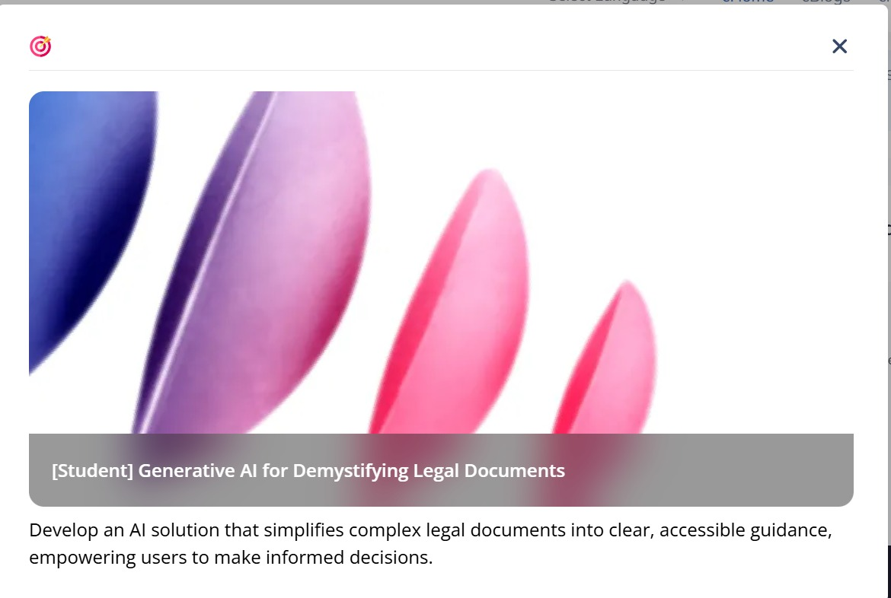
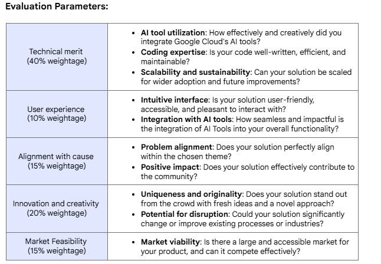
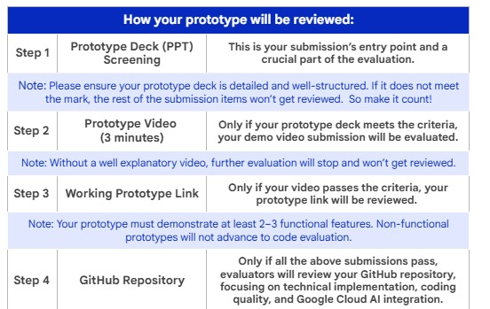

# Centralized Project Resources

`"THIS PAGE IS INCOMPLETE AND YOU ARE SUPPOSED TO AMEND THIS PAGE AS PER THE NEED"`

This file contains all the essential links, assets, and documentation for our project. Bookmark this page!

## 1. Official Hackathon Materials

### Problem Statement

### Evaluation Parameters

### Submission Process

- **Official Hackathon Website:** [ Official Website To be Inserted]
- **Submission Portal Link:** [Submission Portal Link To be Inserted]

## 2. Team Collaboration & Assets

- **Prototype Submission Deck:** [Link to the PPT file in this repo]
- **Team Communication Channel:** [Insert Slack/Discord Link Here]
- **Idea Brainstorming Board:** [Insert Miro/FigJam/Google Doc Link Here]

## 3. Technical Documentation (For the "Legal Docs" Idea)

If we proceed with this idea, here is the documentation for the likely technologies we'll use:

- **Google Cloud AI:**
  - [Vertex AI Gemini API Docs](https://cloud.google.com/vertex-ai/docs/generative-ai/model-reference/gemini)
  - [Document AI Docs](https://cloud.google.com/document-ai/docs)
  - [Vertex AI Vector Search Docs](https://cloud.google.com/vertex-ai/docs/vector-search)
- **Infrastructure:**
  - [Google Cloud Run Docs](https://cloud.google.com/run/docs)
  - [Google Cloud Functions Docs](https://cloud.google.com/functions/docs)

## 4. Market & Competitive Research

- [Research.pdf](./resource.md)
